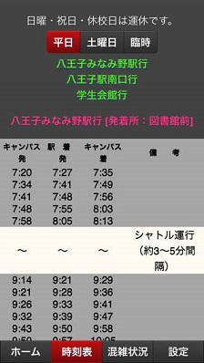

TUT-BusTime
==

東京工科大学のスクールバス時刻表、混雑状況共有アプリ 
   

gettable.js：バックエンドよりプロパティの取得、公式交通案内ページより時刻表のスクレイピング 
index.html:表示ページ 
inport.js:JSファイルをまとめたもの 
location.js:GPS座標取得 
onbutton.js:イベント処理まとめ 
timenow.js:次の発車時刻の取得 
twitterapi.js:Twitterの受信、送信 
Twitter-coop.js:Twitterとの連携 
